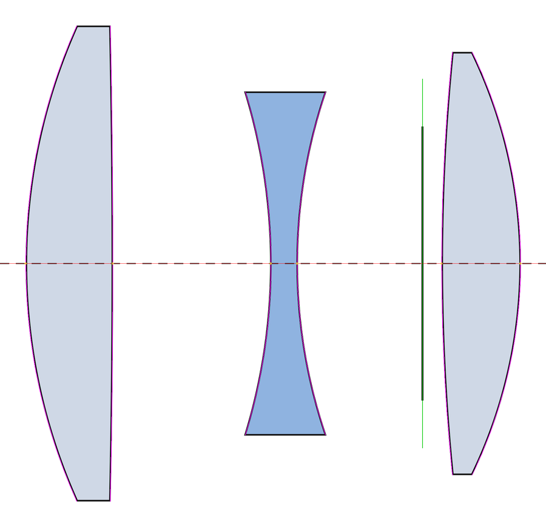

# lens-diagram-to-dxf

把**镜头光学结构图**（厂商官网/说明书里的 lens construction 图，PNG / JPG / SVG）反推成逐面数据：
自动找光轴、分出每片镜片、按「圆心落在光轴上」拟合每个面，输出

- **Excel** 面数据表（面序号 / 面型 / 曲率半径 / 厚度 / 玻璃占位 / 标记 / 半口径 / 作图半径 / 拟合 RMS）
- **AutoCAD DXF**（光轴、各面 ARC、边缘线、光阑、尺寸标注，可把原图按比例贴在底层对照）
- **CODE V `.seq`**（最简序列，`in` 进去就能看 layout）

> Reverse-engineer per-surface lens data (radii, thicknesses, semi-diameters) from a published
> lens construction diagram, and export it as Excel / AutoCAD DXF / CODE V sequence.

你只需要给**一个尺度**：总长、最大镜片直径、或 px/mm，三选一。



## 精度

仓库自带一个**往返自测**：用已知处方画一张合成结构图，再反推回来比对。

```
$ cd examples/demo && python3 make_demo.py
$ python3 ../../scripts/diag_extract.py demo.svg -o demo.json --length 18.719 --svg-width 1800
$ python3 compare.py

  面       R 真值       R 反推       误差 |     D 真值     D 反推       误差
  1     22.014     21.986   -0.13% |    3.259    3.288   +0.029
  2   -435.760   -436.718   -0.22% |    6.008    5.984   -0.024
  3    -22.213    -22.188   +0.11% |    1.000    0.995   -0.005
  4     20.291     20.281   -0.05% |    4.750    4.740   -0.010
STO        INF        INF          |    0.750    0.728   -0.022
  6     79.684     79.514   -0.21% |    2.952    2.983   +0.031
  7    -18.395    -18.370   +0.14% |    0.000    0.000   +0.000

曲率半径：最大误差 0.22%，平均 0.14%
厚度/间隔：最大误差 0.031 mm，平均 0.017 mm
```

这是**最好情况**：合成图、无非球面、渲染干净、87 px/mm。真实厂商图上，
[适马 85mm F1.2 那个案例](examples/sigma85/)（26.5 px/mm）逐面偏差平均 0.66 px ≈ 25 µm。

弱曲率面（|R| > 150 mm）从图上只能拟到 ±15%，非球面报的是最佳拟合球面，只能当初值。

## 用法

```bash
pip install -r requirements.txt

# 1) 提取：图 → JSON + 叠加核对图
python3 scripts/diag_extract.py diagram.png -o lens.json \
        --crop WxH+X+Y --length 119.72 --overlay ov.png --debug dbg

# 2) 目检 ov.png（品红=拟合弧）和 dbg_parts.png（每片一色），确认分片数 = 图上镜片数

# 3) 建表出图
python3 scripts/diag_build.py lens.json -o OUT --seq --image diagram_crop.jpg

# 4) 验收：把拟合弧压回原图逐行量偏差，全局平均 < 1 px 算合格
python3 scripts/fit_check.py lens.json diagram_crop.png
```

裁图时只保留镜头本体，**去掉图例色块、标题文字、尺寸线、外框**——它们会被当成假镜片。

## 它解决了什么

从图上量镜头看着简单，坑全在细节里。这些都是被实际打回来之后才修对的：

- **描边就是透镜边缘本身，只是线画得粗。** 真实面在描边的**中心线**上，不是填充区的内边。
  取错的话每片都瘦掉一个线宽，相邻片之间凭空多出 ≈0.2 mm 的假气隙，在 CAD 里表现为口径打架。
- **别用「x 不再变化」去砍机械磨边。** 弱曲率面的 dx/dy 本来就小于 0.5 px/行，
  这么砍会把 40% 的真实弧当磨边扔掉，半径直接错 17%。改成「靠近光轴的一半当种子 + 逐轮吸收」的稳健拟合。
- **未填充的镜片 vs 被围起来的空气**，在线稿里长得一模一样。按**边缘**判：
  镜片一定有有限厚度的机械边缘，空气楔两端是两条面弧的交点，是真正的尖点。
- **作图半径要做穿透截断**，否则相邻两面的弧会互相穿透。
- 带 alpha 通道的 PNG 必须先合成到白底，否则透明区变纯黑，整幅图的背景判断全错。
- AutoCAD 贴图那一串坑（`ACAD_IMAGE_DICT` 的键不能带路径和扩展名、`dimlfac` 默认 100、
  组码 290 的位置……）见 [`SKILL.md`](SKILL.md) 的「踩过的坑」。

## 文件

```
scripts/diag_extract.py   图 → lens.json（+ 叠加图、分片调试图）
scripts/diag_build.py     lens.json → xlsx / dxf / seq / spec.json
scripts/fit_check.py      验收：拟合弧压回原图逐行量偏差
SKILL.md                  完整流程、算法说明、踩过的坑（也是一个 Claude skill）
examples/demo/            合成示例 + 往返精度自测
examples/sigma85/         真实案例：适马 85mm F1.2
```

`SKILL.md` 本身是一个 [Claude Code](https://claude.com/claude-code) skill：把整个目录放进
skills 目录，描述这类活的时候就会自动触发。当然脚本也可以完全脱离 Claude 单独用。

## 局限

- **不输出玻璃。** 结构图给不出折射率，玻璃一律占位 `BSC7`，要自己补。
- 非球面只给最佳拟合球面。
- 光阑如果画成上下两段短竖线（不贯穿），要手工定位后插进 `lens.json`，方法见 SKILL.md §4.5。
- 反推数据只适合当优化初值或做结构对照，**不是厂商的实际设计数据**。

## License

MIT
