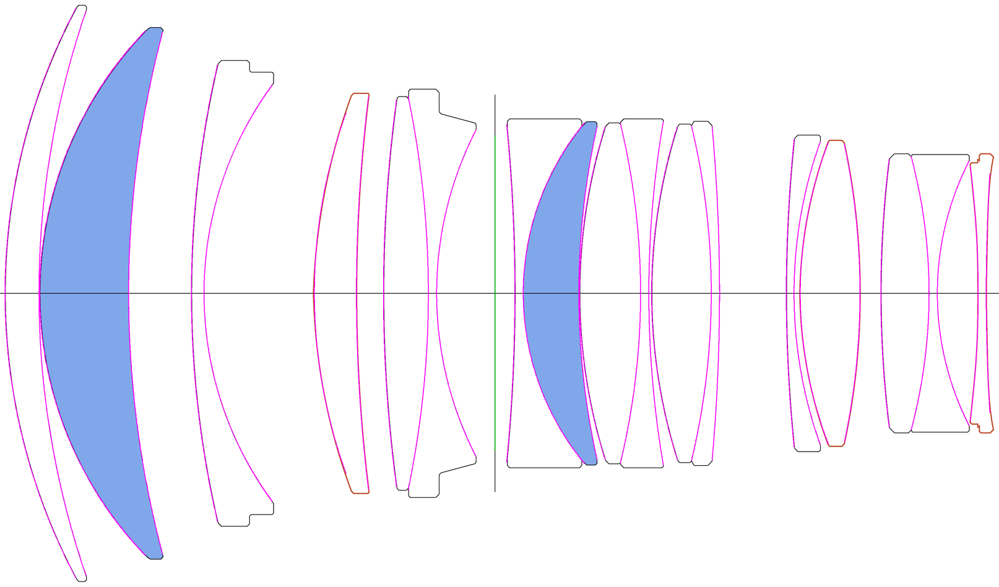

# SIGMA 85mm F1.2 — 实战案例

输入是适马公开的光学结构图（白底线稿 + 蓝色填充 + 红色描边），**唯一给定的尺度是总长 119.72 mm**
（首面顶点 → 末面顶点）。

| | |
|---|---|
| 元件 | 17 片 |
| 面 | 29 个折射面 + 1 个光阑 |
| 比例尺 | 26.48 px/mm |
| 逐面拟合偏差 | 平均 **0.66 px ≈ 25 µm**，无单面超过 1.5 px |
| `sum(D)` 回算 | 119.721 mm（与给定总长一致） |

品红 = 反推出来的面弧压回原图，绿 = 光阑。

## 文件

- `SIGMA85.xlsx` — 面数据表（面序号/面型/曲率半径/THICKNESS/玻璃/标记/半口径/作图半径/拟合RMS/备注）
- `SIGMA85.dxf` — AutoCAD 图（mm，图层 AXIS/SURF/EDGE/STOP/DIM）
- `SIGMA85.seq` — 最简 CODE V 序列，`in` 进去就能看 layout
- `lens.json` — 中间结果，可以自己改完重新 build

## 已知限制

- **玻璃全部是占位 `BSC7`**。结构图给不出折射率，只能靠面型和图例颜色猜，这里没猜。
- 图上没有图例，只有颜色：蓝色填充 2 片（面 3/4、13/14），红色描边 3 片（面 7/8、23/24、28/29）。
  适马惯例蓝色多为非球面、橙红多为 SLD，但**图上没写，这是推测**。
- 面 7 拟合 rms 1.27 px（全部面里最大），被自动标了「可能非球面」，需要人工确认。
- `.seq` 里的 `FNO 1.2` 和视场角是按 85mm 全画幅填的**占位值**，不是从图上量的。
- 反推结果只适合当优化初值或做结构对照，**不是适马的实际设计数据**。

结构图版权归适马所有，本目录只放反推出来的数据和一张用于核对的叠加图，不含原图。
